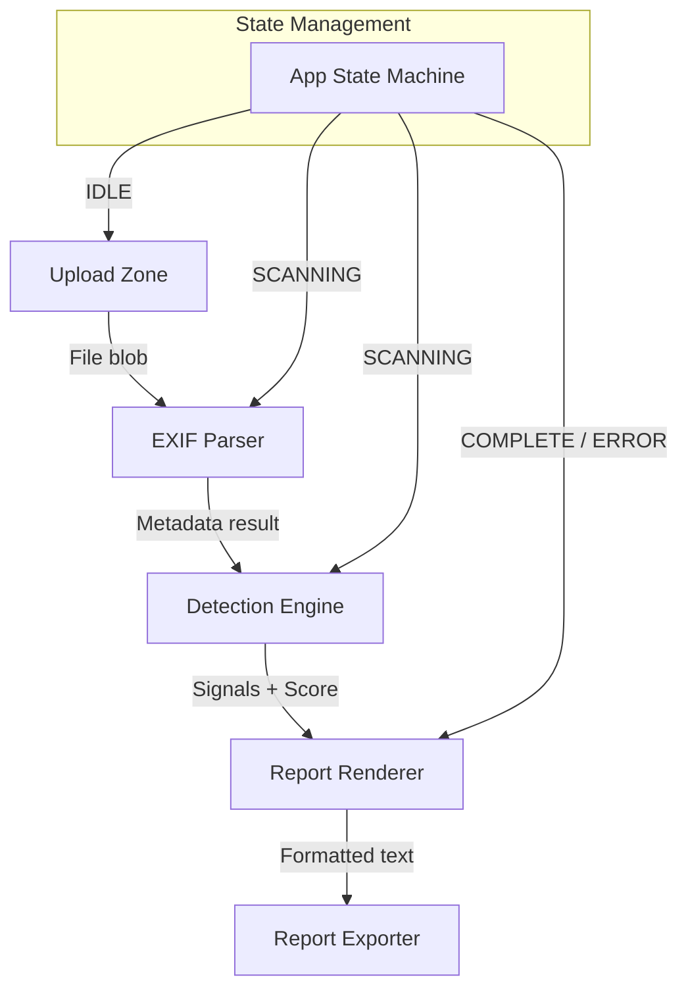
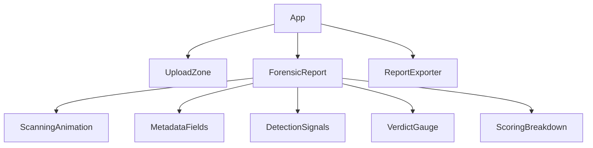
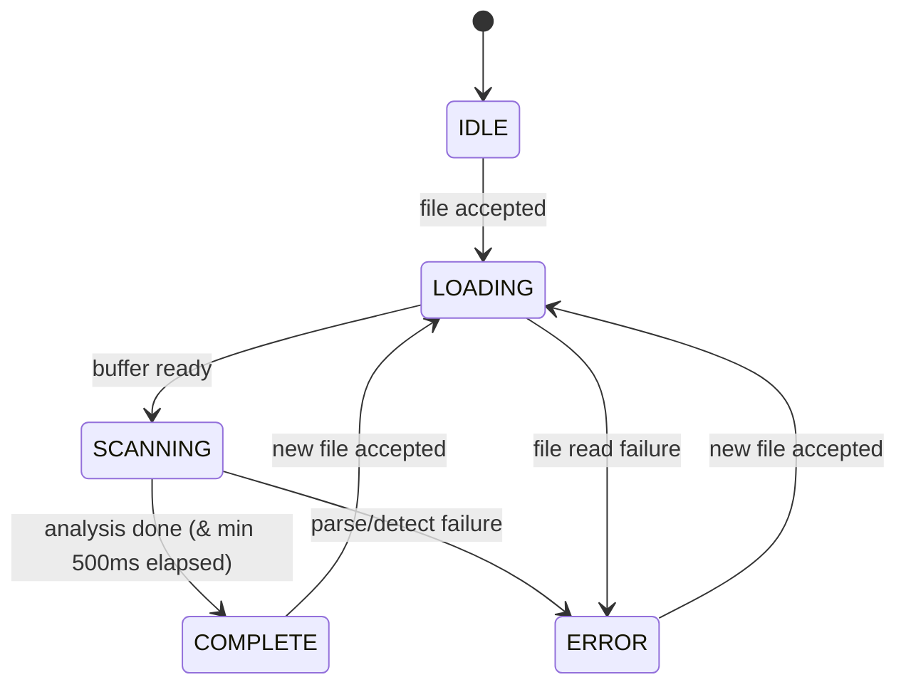

# Design Document: FrameForge Verify — Image Authenticity Analyzer

## Overview

FrameForge Verify is a client-side React single-page application that performs forensic analysis of dashcam images. The system accepts image uploads, extracts EXIF metadata using the exifr library (loaded from CDN), evaluates the metadata against known AI/synthetic generation signatures, and produces a scored forensic report.

The architecture is a unidirectional data pipeline:

```
Upload → Parse → Detect → Score → Report
```

All computation runs in the browser. No data leaves the client. The UI renders a forensic-themed dark interface with animated transitions between pipeline stages.

### Key Design Decisions

1. **CDN-loaded exifr library** — The exifr library is imported as an ES module from jsdelivr CDN (`https://cdn.jsdelivr.net/npm/exifr/dist/full.esm.js`). This avoids bundling a large parsing library and allows the application to remain lightweight. A load-failure state is handled at app initialization.

2. **Pipeline state machine** — The application models the analysis as a state machine (IDLE → LOADING → SCANNING → COMPLETE | ERROR). This makes the scanning animation logic deterministic and testable.

3. **Scoring as pure function** — The Detection Engine and Authenticity Scoring are implemented as pure functions (signals in → score out) with no side effects, enabling property-based testing of the scoring logic.

4. **Single-image model** — Only one image is analyzed at a time. Uploading a new image resets the entire pipeline state.

## Architecture



### Component Hierarchy



### Data Flow

1. User drops/selects an image file
2. `UploadZone` validates format (MIME + extension) and size (≤50 MB)
3. File is read via `FileReader` as `ArrayBuffer`
4. `ExifParser` calls `exifr.parse(arrayBuffer, { ifd0: true, exif: true, gps: true, ... })` to extract metadata
5. `DetectionEngine.analyze(metadata)` evaluates signals and returns `{ signals, score, verdict }`
6. `ForensicReport` renders the results with color coding and animation
7. `ReportExporter` formats results as clipboard-ready plain text

## Components and Interfaces

### UploadZone

**Responsibility:** Accept image input via drag-and-drop or file picker. Validate format and size. Produce a `File` object for downstream processing.

```typescript
interface UploadZoneProps {
  onFileAccepted: (file: File) => void;
  onError: (error: UploadError) => void;
  isProcessing: boolean;
}

type UploadError = {
  type: 'UNSUPPORTED_FORMAT' | 'FILE_TOO_LARGE' | 'CORRUPT_IMAGE';
  message: string;
};

const SUPPORTED_MIME_TYPES = [
  'image/jpeg', 'image/png', 'image/heic', 'image/webp'
] as const;

const SUPPORTED_EXTENSIONS = [
  '.jpg', '.jpeg', '.png', '.heic', '.heif', '.webp'
] as const;

const MAX_FILE_SIZE_BYTES = 50 * 1024 * 1024; // 50 MB
```

**Validation logic:**
1. Check MIME type against `SUPPORTED_MIME_TYPES`
2. Check file extension against `SUPPORTED_EXTENSIONS`
3. Check `file.size <= MAX_FILE_SIZE_BYTES`
4. Attempt to create an `Image` element from the file blob to verify decodability

### ExifParser

**Responsibility:** Extract structured EXIF metadata from an image ArrayBuffer using the exifr library. Normalize the output into a canonical `MetadataResult` shape.

```typescript
interface MetadataField<T> {
  value: T | null;
  status: 'present' | 'absent' | 'corrupt';
}

interface MetadataResult {
  cameraMake: MetadataField<string>;
  cameraModel: MetadataField<string>;
  lensMake: MetadataField<string>;
  lensModel: MetadataField<string>;
  focalLength: MetadataField<number>;
  dateTimeOriginal: MetadataField<Date>;
  modifyDate: MetadataField<Date>;
  gpsLatitude: MetadataField<number>;
  gpsLongitude: MetadataField<number>;
  gpsAltitude: MetadataField<number>;
  fNumber: MetadataField<number>;
  iso: MetadataField<number>;
  exposureTime: MetadataField<number>;
  software: MetadataField<string>;
  imageWidth: MetadataField<number>;
  imageHeight: MetadataField<number>;
  bitDepth: MetadataField<number>;
  colorProfile: MetadataField<string>;
}

async function parseExif(buffer: ArrayBuffer): Promise<MetadataResult>;
```

**exifr configuration:**
```typescript
const EXIFR_OPTIONS = {
  ifd0: true,
  exif: true,
  gps: true,
  interop: false,
  ifd1: false,
  translateValues: true,
  translateKeys: true,
  reviveValues: true,
};
```

The parser maps exifr's flat output into the `MetadataResult` structure, marking each field as `present` (with value), `absent` (field not in EXIF), or `corrupt` (field present but unparsable).

### DetectionEngine

**Responsibility:** Evaluate metadata for AI/synthetic indicators. Produce detection signals and compute the authenticity score. This is a **pure function** module.

```typescript
interface DetectionSignal {
  type: SignalType;
  severity: number;       // 0.0 to 1.0
  triggerField: string;   // metadata field name that triggered it
  description: string;
}

type SignalType =
  | 'SOFTWARE_FINGERPRINT'
  | 'MISSING_EXIF'
  | 'TIMESTAMP_INCONSISTENCY'
  | 'FILE_SIZE_ANOMALY'
  | 'COLOR_PROFILE_ABNORMALITY'
  | 'MISSING_GPS';

interface ScoringResult {
  score: number;          // 0–100 integer
  verdict: Verdict;
  signals: DetectionSignal[];
  breakdown: ScoringBreakdownEntry[];
}

interface ScoringBreakdownEntry {
  signalType: SignalType;
  triggered: boolean;
  pointsDeducted: number;
  maxDeduction: number;
}

type Verdict = 'GENUINE' | 'SUSPICIOUS' | 'LIKELY SYNTHETIC';

const MAX_DEDUCTIONS: Record<SignalType, number> = {
  SOFTWARE_FINGERPRINT: 30,
  MISSING_EXIF: 25,
  TIMESTAMP_INCONSISTENCY: 15,
  FILE_SIZE_ANOMALY: 15,
  COLOR_PROFILE_ABNORMALITY: 10,
  MISSING_GPS: 5,
};

const AI_SOFTWARE_KEYWORDS = [
  'dall-e', 'midjourney', 'stable diffusion',
  'photoshop', 'adobe firefly', 'leonardo', 'runway'
];

function analyze(metadata: MetadataResult, fileSize: number): ScoringResult;
```

**Signal evaluation rules:**
1. **MISSING_EXIF** — Count present fields from {Make, Model, DateTimeOriginal, ExposureTime, FNumber, ISO}. If fewer than 3 are present, trigger with severity = `(3 - presentCount) / 3`.
2. **SOFTWARE_FINGERPRINT** — Case-insensitive match of Software field against `AI_SOFTWARE_KEYWORDS`. Severity 1.0 if matched.
3. **TIMESTAMP_INCONSISTENCY** — If both DateTimeOriginal and ModifyDate are present and differ by >24 hours, trigger. Severity scales with the time difference (capped at 1.0 for >30 days).
4. **MISSING_TIMESTAMP** — Treated as TIMESTAMP_INCONSISTENCY type. If either timestamp is absent, severity 0.5.
5. **FILE_SIZE_ANOMALY** — Compare actual file size to expected uncompressed size (`width × height × channels × bytesPerChannel`). Trigger if ratio < 0.2 or > 5.0. Severity proportional to deviation.
6. **COLOR_PROFILE_ABNORMALITY** — Trigger if color profile is absent OR bit depth is not 8 or 16. Severity 1.0 if both conditions met, 0.5 if only one.
7. **MISSING_GPS** — If GPS latitude or longitude is absent, trigger. Severity 1.0.

**Scoring algorithm (pure function):**
```
score = 100
for each signalType in MAX_DEDUCTIONS:
    signals_of_type = filter signals by type
    if signals_of_type is not empty:
        highest_severity = max(signal.severity for signal in signals_of_type)
        deduction = round(MAX_DEDUCTIONS[signalType] * highest_severity)
        score -= deduction
score = max(0, score)
```

**Verdict mapping:**
- score ≥ 70 → GENUINE
- 40 ≤ score ≤ 69 → SUSPICIOUS  
- score < 40 → LIKELY SYNTHETIC

### ForensicReport

**Responsibility:** Render the analysis results with color-coded fields, collapsible sections, scanning animation, and verdict gauge.

```typescript
interface ForensicReportProps {
  state: PipelineState;
  metadata: MetadataResult | null;
  result: ScoringResult | null;
  thumbnail: string | null; // data URL
}

type PipelineState = 'IDLE' | 'LOADING' | 'SCANNING' | 'COMPLETE' | 'ERROR';
```

**Color coding logic:**
- Field status `present` + not in any signal's `triggerField` → green (#22c55e)
- Field is the `triggerField` of any signal → amber (#f59e0b)
- Field status `absent` or `corrupt` → red (#ef4444)

**Sections:**
1. Raw Metadata — all fields from MetadataResult  
2. AI Detection Signals — list of triggered signals with descriptions
3. Verdict — circular gauge + score + verdict label

### ScanningAnimation

**Responsibility:** Render the scan-line animation during processing state.

- Display "SCANNING..." label with CSS pulsing animation
- Animate a horizontal line sweeping vertically over the thumbnail (1 sweep per 1.5s via CSS `@keyframes`)
- Enforce minimum 500ms display time before transitioning to COMPLETE
- On error, stop animation and show error message

### ReportExporter

**Responsibility:** Format results as plain text and copy to clipboard.

```typescript
interface ReportExporterProps {
  metadata: MetadataResult;
  result: ScoringResult;
  fileName: string;
  analysisTimestamp: Date;
}

function formatReport(props: ReportExporterProps): string;
```

**Text format:**
```
=== FRAMEFORGE VERIFY - FORENSIC REPORT ===
File: {fileName}
Analyzed: {ISO 8601 timestamp}

--- METADATA ---
Camera Make: {value or "MISSING"}
Camera Model: {value or "MISSING"}
...

--- DETECTION SIGNALS ---
[TRIGGERED] SOFTWARE_FINGERPRINT: {description}
[CLEAR] TIMESTAMP_INCONSISTENCY
...

--- SCORING BREAKDOWN ---
Software Fingerprint: -{points} (max -30)
...

--- VERDICT ---
Authenticity Score: {score}/100
Verdict: {verdict}
========================================
```

### VerdictGauge

**Responsibility:** Render the circular score gauge with color matching the verdict.

- SVG-based circular arc
- Arc fill percentage = `score / 100`
- Color: green (#22c55e) for GENUINE, amber (#f59e0b) for SUSPICIOUS, red (#ef4444) for LIKELY SYNTHETIC
- Center text: score value + verdict label

## Data Models

### Application State

```typescript
interface AppState {
  pipeline: PipelineState;
  file: File | null;
  thumbnail: string | null;
  metadata: MetadataResult | null;
  result: ScoringResult | null;
  error: AppError | null;
  scanStartTime: number | null;
}

type AppError = {
  phase: 'upload' | 'parse' | 'detect' | 'library';
  message: string;
};
```

### State Transitions



### MetadataResult Field Catalog

| Field | EXIF Tag | Type | Unit |
|-------|----------|------|------|
| cameraMake | Make (IFD0) | string | — |
| cameraModel | Model (IFD0) | string | — |
| lensMake | LensMake (EXIF) | string | — |
| lensModel | LensModel (EXIF) | string | — |
| focalLength | FocalLength (EXIF) | number | mm |
| dateTimeOriginal | DateTimeOriginal (EXIF) | Date | — |
| modifyDate | ModifyDate (IFD0) | Date | — |
| gpsLatitude | GPSLatitude (GPS) | number | decimal degrees |
| gpsLongitude | GPSLongitude (GPS) | number | decimal degrees |
| gpsAltitude | GPSAltitude (GPS) | number | meters |
| fNumber | FNumber (EXIF) | number | f-stop |
| iso | ISOSpeedRatings (EXIF) | number | — |
| exposureTime | ExposureTime (EXIF) | number | seconds |
| software | Software (IFD0) | string | — |
| imageWidth | ImageWidth / PixelXDimension | number | pixels |
| imageHeight | ImageHeight / PixelYDimension | number | pixels |
| bitDepth | BitsPerSample | number | bits |
| colorProfile | ColorSpace / ICCProfile | string | — |

### Signal Severity Weights

| Signal Type | Max Deduction | Severity Calculation |
|-------------|---------------|---------------------|
| SOFTWARE_FINGERPRINT | 30 | 1.0 (binary match) |
| MISSING_EXIF | 25 | (3 - presentCount) / 3 |
| TIMESTAMP_INCONSISTENCY | 15 | min(1.0, hoursDiff / 720) |
| FILE_SIZE_ANOMALY | 15 | min(1.0, abs(ratio - 1.0) / 4.0) |
| COLOR_PROFILE_ABNORMALITY | 10 | 0.5 per condition (max 1.0) |
| MISSING_GPS | 5 | 1.0 (binary) |

## Correctness Properties

*A property is a characteristic or behavior that should hold true across all valid executions of a system — essentially, a formal statement about what the system should do. Properties serve as the bridge between human-readable specifications and machine-verifiable correctness guarantees.*

### Property 1: Field extraction preserves values

*For any* valid exifr output object containing EXIF fields (strings, numbers, dates), the `parseExif` function SHALL produce a `MetadataResult` where every present field's value exactly matches the input: string fields preserve the original character sequence, numeric fields preserve the original numeric value, and date fields preserve the original timestamp to the second.

**Validates: Requirements 2.1, 2.2, 2.4, 2.5, 2.6, 9.1**

### Property 2: All fields always present in output

*For any* input ArrayBuffer (including those with no EXIF data at all), the `parseExif` function SHALL return a `MetadataResult` containing every field defined in the MetadataResult interface, each with a valid `status` of 'present', 'absent', or 'corrupt' — no field is ever omitted from the result.

**Validates: Requirements 2.7, 2.8**

### Property 3: Corrupt fields reported as corrupt

*For any* EXIF field that is present in the input but contains malformed or unreadable data, the `parseExif` function SHALL report that field with status 'corrupt' rather than omitting the field or substituting a default value.

**Validates: Requirements 2.9, 9.4**

### Property 4: GPS precision preservation

*For any* GPS coordinate value (latitude, longitude, altitude) extracted by the parser, the output SHALL represent latitude and longitude as decimal degrees with at least 6 decimal places of precision and altitude as meters with at least 1 decimal place of precision.

**Validates: Requirements 2.3, 9.3**

### Property 5: MISSING_EXIF signal threshold

*For any* `MetadataResult`, the Detection Engine SHALL trigger a MISSING_EXIF signal if and only if fewer than 3 of the 6 core fields (Make, Model, DateTimeOriginal, ExposureTime, FNumber, ISOSpeedRatings) have status 'present'.

**Validates: Requirements 3.1**

### Property 6: SOFTWARE_FINGERPRINT detection

*For any* `MetadataResult` where the Software field is present, the Detection Engine SHALL trigger a SOFTWARE_FINGERPRINT signal if and only if the Software value contains a case-insensitive match against any entry in the AI software keyword list.

**Validates: Requirements 3.2**

### Property 7: TIMESTAMP_INCONSISTENCY detection

*For any* `MetadataResult`, the Detection Engine SHALL trigger a TIMESTAMP_INCONSISTENCY signal when: (a) both DateTimeOriginal and ModifyDate are present and differ by more than 24 hours, OR (b) either DateTimeOriginal or ModifyDate is absent.

**Validates: Requirements 3.3, 3.4**

### Property 8: FILE_SIZE_ANOMALY detection

*For any* combination of file size and image dimensions (width × height × channels × bytesPerChannel), the Detection Engine SHALL trigger a FILE_SIZE_ANOMALY signal if and only if the ratio of actual file size to expected uncompressed size is less than 0.2 or greater than 5.0.

**Validates: Requirements 3.5, 3.6**

### Property 9: COLOR_PROFILE_ABNORMALITY detection

*For any* `MetadataResult`, the Detection Engine SHALL trigger a COLOR_PROFILE_ABNORMALITY signal if and only if the color profile is absent OR the bit depth is not 8 or 16 bits per channel.

**Validates: Requirements 3.7**

### Property 10: Signal structure invariant

*For any* signal produced by the Detection Engine, the signal SHALL contain a valid `type` (one of the defined SignalType values), a `severity` weight in the range [0.0, 1.0] inclusive, and a non-empty `triggerField` string identifying the metadata field that triggered detection.

**Validates: Requirements 3.9**

### Property 11: Score range invariant

*For any* set of detection signals, the `computeScore` function SHALL produce an integer score in the range [0, 100] inclusive, starting from a base of 100 and subtracting deductions, never falling below 0.

**Validates: Requirements 4.1, 4.2**

### Property 12: Per-signal deduction capping

*For any* signal with severity ≤ 1.0, the deduction applied for that signal's type SHALL NOT exceed the defined maximum deduction for that type (SOFTWARE_FINGERPRINT: 30, MISSING_EXIF: 25, TIMESTAMP_INCONSISTENCY: 15, FILE_SIZE_ANOMALY: 15, COLOR_PROFILE_ABNORMALITY: 10, MISSING_GPS: 5).

**Validates: Requirements 4.3**

### Property 13: Same-type signal deduplication

*For any* set of signals containing multiple signals of the same type, the scoring function SHALL apply the deduction for that type only once, using the highest severity instance.

**Validates: Requirements 4.4**

### Property 14: Verdict mapping

*For any* authenticity score, the verdict SHALL be: GENUINE when score ≥ 70, SUSPICIOUS when 40 ≤ score ≤ 69, and LIKELY SYNTHETIC when score < 40.

**Validates: Requirements 4.5, 4.6, 4.7**

### Property 15: Scoring breakdown completeness

*For any* scoring result, the breakdown SHALL list all 6 signal types with their triggered status, points deducted, and maximum possible deduction — regardless of whether any signals of that type were triggered.

**Validates: Requirements 4.8**

### Property 16: Field color coding

*For any* metadata field in the forensic report, the color coding SHALL be: green (#22c55e) when the field has status 'present' and is not a trigger field of any signal, amber (#f59e0b) when the field is the trigger field of any signal, and red (#ef4444) when the field has status 'absent' or 'corrupt'.

**Validates: Requirements 6.1, 6.4, 6.8**

### Property 17: Report format completeness

*For any* valid `MetadataResult` and `ScoringResult`, the `formatReport` function SHALL produce a string containing all required sections: Header (file name, analysis timestamp), Metadata Fields (all field name: value pairs), Detection Signals (each signal type and status), Scoring Breakdown (per-signal deductions), and Verdict (score and category).

**Validates: Requirements 7.2**

### Property 18: Report display fidelity

*For any* `MetadataResult`, the Forensic Report SHALL display each field using the exact field name and value as returned by the parser, where the only permitted formatting transformations are: date values rendered in ISO 8601 format, numeric values rendered with their unit label appended, and string values displayed verbatim with no truncation.

**Validates: Requirements 9.2**

### Property 19: Format validation

*For any* file metadata (MIME type and extension pair), the upload validation function SHALL accept the file if and only if the MIME type is one of (image/jpeg, image/png, image/heic, image/webp) AND the extension is one of (.jpg, .jpeg, .png, .heic, .heif, .webp).

**Validates: Requirements 1.1, 1.5**

## Error Handling

### Error Categories

| Phase | Error | User-Facing Message | Recovery |
|-------|-------|-------------------|----------|
| Library Load | CDN import failure | "EXIF parsing library could not be loaded. Analysis unavailable." | Retry page reload |
| Upload | Unsupported format | "Unsupported format. Please upload JPG, PNG, HEIC, or WebP." | Upload new file |
| Upload | File too large | "File exceeds 50 MB limit." | Upload smaller file |
| Upload | Corrupt image | "File could not be decoded as a valid image." | Upload different file |
| Parse | exifr exception | "Metadata extraction failed. File may be damaged." | Upload different file |
| Detect | Unexpected error | "Analysis error. Please try again." | Upload same/new file |

### Error Propagation

Errors propagate through the pipeline state machine. Any error transitions the app to ERROR state, which:
1. Stops any running animation
2. Displays the error message in the report area
3. Keeps the upload zone active for retry
4. Clears any partial results

### Defensive Patterns

- **exifr output normalization** — Wrap all field access in try/catch to handle unexpected exifr output shapes. Any field that throws during access is marked as 'corrupt'.
- **File validation before parse** — Validate format and size before reading the file into memory to avoid unnecessary processing.
- **Image decode verification** — After format/size validation, attempt to create an Image from the blob. If `onerror` fires, report corruption.
- **Clipboard API fallback** — If `navigator.clipboard.writeText` rejects (permissions, secure context), fall back to displaying a `<textarea>` with the report text.

## Testing Strategy

### Property-Based Tests (fast-check)

The project will use [fast-check](https://github.com/dubzzz/fast-check) as the property-based testing library with Vitest as the test runner.

**Configuration:**
- Minimum 100 iterations per property test (`numRuns: 100`)
- Each property test references its design property with a tag comment
- Tag format: `// Feature: frameforge-verify, Property {N}: {title}`

**Properties to implement:**
- Properties 1–4: EXIF Parser module (pure function tests with generated exifr output objects)
- Properties 5–9: Detection Engine signal evaluation (generated MetadataResult inputs)
- Properties 10–15: Scoring algorithm (generated signal sets)
- Property 16: Color coding logic (generated field status + signal combinations)
- Properties 17–18: Report formatter (generated MetadataResult + ScoringResult)
- Property 19: Format validation (generated MIME type + extension pairs)

### Unit Tests (Vitest)

Example-based tests for:
- Upload zone UI interactions (drag, drop, click, error display)
- Scanning animation state transitions
- Collapsible section toggle behavior
- Clipboard copy success/failure flows
- CDN library load failure handling
- Specific edge cases (50MB boundary, empty EXIF, all fields corrupt)

### Integration Tests

- End-to-end flow with a real JPEG containing known EXIF data
- Verify no network requests made during analysis (mock Service Worker)
- Clipboard API interaction with browser mock

### Test File Organization

```
src/
├── lib/
│   ├── exif-parser.ts
│   ├── exif-parser.test.ts          # Unit tests
│   ├── exif-parser.property.test.ts # Property tests (Properties 1-4)
│   ├── detection-engine.ts
│   ├── detection-engine.test.ts
│   ├── detection-engine.property.test.ts # Property tests (Properties 5-10)
│   ├── scoring.ts
│   ├── scoring.test.ts
│   ├── scoring.property.test.ts     # Property tests (Properties 11-15)
│   ├── report-formatter.ts
│   ├── report-formatter.test.ts
│   └── report-formatter.property.test.ts # Property tests (Properties 17-18)
├── components/
│   ├── UploadZone/
│   ├── ForensicReport/
│   ├── ScanningAnimation/
│   ├── VerdictGauge/
│   └── ReportExporter/
└── utils/
    ├── validation.ts
    ├── validation.test.ts
    └── validation.property.test.ts  # Property test (Properties 16, 19)
```

