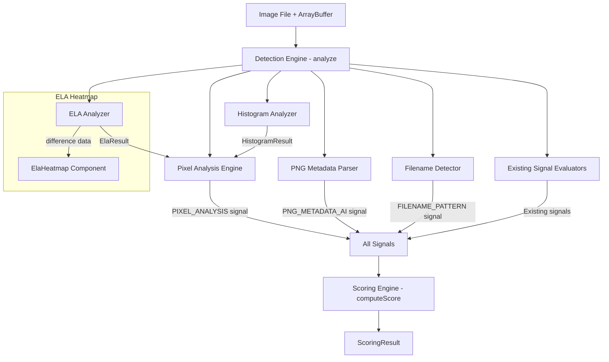
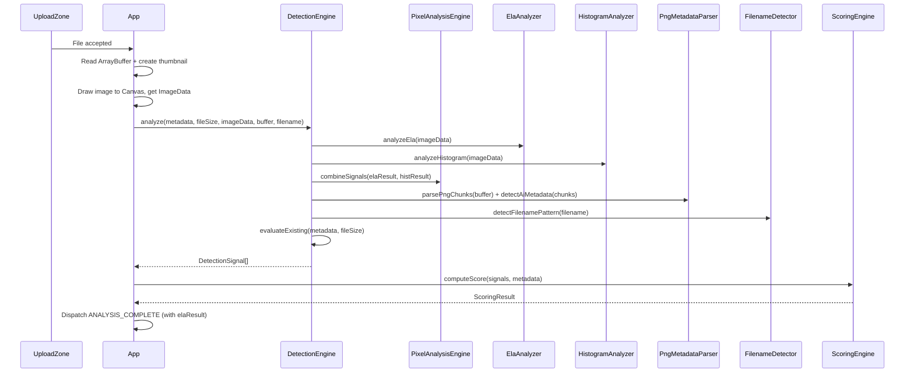

# Design Document: Pixel-Level Detection for FrameForge Verify

## Overview

This feature extends FrameForge Verify's detection capabilities from metadata-only analysis to pixel-level image forensics. It adds three new signal types (`PIXEL_ANALYSIS`, `PNG_METADATA_AI`, `FILENAME_PATTERN`) that integrate into the existing detection engine and scoring pipeline.

The architecture adds four new pure-function modules alongside the existing `detection-engine.ts` and `scoring.ts`:

```
Image File → ELA Analyzer ──────────┐
           → Histogram Analyzer ─────┼── Pixel Analysis Engine → PIXEL_ANALYSIS signal
                                     │
           → PNG Metadata Parser ────┼── PNG_METADATA_AI signal
           → Filename Detector ──────┼── FILENAME_PATTERN signal
                                     │
           → (Existing analyzers) ───┘── Existing signals
                                     │
                              Detection Engine (orchestrates all)
                                     │
                              Scoring Engine (computes score from all signals)
```

All processing runs client-side using Canvas API and ArrayBuffer/DataView — zero external dependencies.

### Key Design Decisions

1. **Canvas API for ELA** — Re-compression via `canvas.toDataURL('image/jpeg', 0.6)` gives us lossy re-encoding without importing any codec library. The Canvas 2D context provides direct pixel access via `getImageData`.

2. **Pure function modules** — Each analyzer (`ela-analyzer.ts`, `histogram-analyzer.ts`, `png-metadata-parser.ts`, `filename-detector.ts`) is a pure function module (input → output, no side effects), enabling property-based testing.

3. **Worst-case signal composition** — ELA and Histogram produce individual severity values; the `PIXEL_ANALYSIS` signal uses the maximum severity so the scoring system sees the most suspicious pixel-level finding.

4. **Graceful degradation** — If Canvas API is unavailable (e.g. OffscreenCanvas not supported), pixel analysis is skipped and the pipeline continues with metadata-only + PNG parsing + filename detection.

5. **PNG binary parsing via DataView** — We parse PNG chunks manually using ArrayBuffer/DataView. This avoids external PNG libraries and gives us access to tEXt/iTXt chunks that standard image decoders discard.

6. **Existing scoring formula preserved** — The new signal types plug into the same `MAX_DEDUCTIONS[type] × severity` formula. Only the `SignalType` union, `MAX_DEDUCTIONS` record, and `ALL_SIGNAL_TYPES` array are extended.

## Architecture



### Module Organization

```
src/lib/
├── detection-engine.ts          # Extended: orchestrates new analyzers
├── scoring.ts                   # Extended: new signal types + deductions
├── types.ts                     # Extended: new types
├── ela-analyzer.ts              # NEW: ELA computation
├── histogram-analyzer.ts        # NEW: Color histogram analysis
├── pixel-analysis-engine.ts     # NEW: Combines ELA + Histogram → PIXEL_ANALYSIS
├── png-metadata-parser.ts       # NEW: PNG tEXt/iTXt chunk parsing
└── filename-detector.ts         # NEW: Filename pattern matching

src/components/
├── ElaHeatmap/
│   ├── ElaHeatmap.tsx           # NEW: Canvas-rendered heatmap
│   └── index.ts
└── ForensicReport/
    └── ForensicReport.tsx       # Extended: renders ElaHeatmap section
```

## Components and Interfaces

### ELA Analyzer

**Responsibility:** Re-compress an image via Canvas API at JPEG quality 60, compute per-pixel absolute differences, normalize, and determine severity based on error uniformity.

```typescript
/** Result of ELA analysis, or null if Canvas is unavailable */
export interface ElaResult {
  /** Mean difference value across all pixels (0–255 scale) */
  meanDifference: number;
  /** Standard deviation of per-block mean differences */
  blockStdDev: number;
  /** Severity: 0.0 (natural) to 1.0 (uniform = AI-like) */
  severity: number;
  /** Raw difference pixel data (for heatmap rendering), RGBA Uint8ClampedArray */
  differenceData: Uint8ClampedArray;
  /** Image dimensions */
  width: number;
  height: number;
}

/**
 * Performs Error Level Analysis on the provided ImageData.
 * 
 * @param imageData - The original image pixel data from canvas.getImageData()
 * @param amplificationFactor - Multiplier for difference values (default: 10)
 * @param blockSize - Pixel block size for variance calculation (default: 16)
 * @returns ElaResult or null if Canvas operations fail
 */
export function analyzeEla(
  imageData: ImageData,
  amplificationFactor?: number,
  blockSize?: number
): ElaResult | null;

/**
 * Computes per-pixel absolute difference between two pixel arrays.
 * Each pixel has 4 channels (RGBA); only RGB are compared.
 * Differences are amplified and clamped to [0, 255].
 */
export function computePixelDifference(
  original: Uint8ClampedArray,
  recompressed: Uint8ClampedArray,
  amplificationFactor: number
): Uint8ClampedArray;

/**
 * Calculates the mean of all RGB channel values in a difference array.
 */
export function computeMeanDifference(differenceData: Uint8ClampedArray): number;

/**
 * Computes standard deviation of per-block mean differences.
 * Divides the image into blockSize×blockSize blocks and computes
 * the mean difference for each block, then returns stddev of those means.
 */
export function computeBlockStdDev(
  differenceData: Uint8ClampedArray,
  width: number,
  height: number,
  blockSize: number
): number;
```

**Algorithm:**
1. Draw original ImageData onto a temporary canvas
2. Export canvas as JPEG quality 0.6 via `toDataURL('image/jpeg', 0.6)`
3. Load the JPEG data URL into an Image, draw onto another canvas, extract ImageData
4. Compute `|original[i] - recompressed[i]| × amplificationFactor` for R, G, B channels, clamp to 255
5. Calculate mean of all differences → `meanDifference`
6. Divide into 16×16 blocks, compute per-block mean, then stddev of block means → `blockStdDev`
7. Severity = `max(0, 1.0 - (blockStdDev / uniformityThreshold))` where threshold = 20

### Histogram Analyzer

**Responsibility:** Compute RGB channel frequency distributions and evaluate smoothness to detect unnaturally uniform color distributions typical of AI-generated images.

```typescript
export interface HistogramResult {
  /** 256-element frequency array for each channel */
  redHistogram: number[];
  greenHistogram: number[];
  blueHistogram: number[];
  /** Smoothness metric per channel (lower = smoother = more suspicious) */
  redSmoothness: number;
  greenSmoothness: number;
  blueSmoothness: number;
  /** Combined severity: 0.0 (natural) to 1.0 (uniform) */
  severity: number;
}

/**
 * Computes RGB histograms and smoothness metrics from pixel data.
 * 
 * @param imageData - The image pixel data (RGBA Uint8ClampedArray)
 * @param smoothnessThreshold - Threshold below which distribution is "too smooth" (default: 50)
 * @returns HistogramResult with per-channel histograms and severity
 */
export function analyzeHistogram(
  imageData: ImageData,
  smoothnessThreshold?: number
): HistogramResult;

/**
 * Computes a 256-bin frequency histogram for a single color channel.
 * @param pixelData - RGBA pixel data
 * @param channelOffset - 0 for Red, 1 for Green, 2 for Blue
 * @returns 256-element array where index = pixel value, value = frequency count
 */
export function computeChannelHistogram(
  pixelData: Uint8ClampedArray,
  channelOffset: number
): number[];

/**
 * Calculates smoothness metric: average absolute difference between adjacent bins.
 * Lower values indicate unnaturally smooth/uniform distributions.
 */
export function computeSmoothness(histogram: number[]): number;
```

**Algorithm:**
1. Iterate pixel data, increment bins for R (offset 0), G (offset 1), B (offset 2)
2. For each channel, compute smoothness = mean(|bin[i+1] - bin[i]|) for i=0..254
3. If all three smoothness values are below the threshold:
   - `severity = 1.0 - (averageSmoothness / threshold)`
4. Otherwise: `severity = 0.0`

### Pixel Analysis Engine

**Responsibility:** Orchestrates ELA and Histogram analyzers, combines their results into a single `PIXEL_ANALYSIS` detection signal.

```typescript
import { DetectionSignal } from './types';
import { ElaResult } from './ela-analyzer';
import { HistogramResult } from './histogram-analyzer';

export interface PixelAnalysisInput {
  /** The original image as ImageData (from canvas getImageData) */
  imageData: ImageData;
}

export interface PixelAnalysisResult {
  ela: ElaResult | null;
  histogram: HistogramResult;
  signal: DetectionSignal | null;
}

/**
 * Runs both ELA and Histogram analysis, produces combined PIXEL_ANALYSIS signal.
 * 
 * @param input - Image pixel data
 * @returns Combined result with optional signal
 */
export function analyzePixels(input: PixelAnalysisInput): PixelAnalysisResult;

/**
 * Combines ELA and Histogram results into a single DetectionSignal.
 * Uses max severity between the two sub-analyses.
 * Returns null if neither analysis produced a severity > 0.
 */
export function combineSignals(
  ela: ElaResult | null,
  histogram: HistogramResult
): DetectionSignal | null;
```

**Signal composition logic:**
```typescript
function combineSignals(ela: ElaResult | null, histogram: HistogramResult): DetectionSignal | null {
  const elaSeverity = ela?.severity ?? 0;
  const histSeverity = histogram.severity;
  
  if (elaSeverity === 0 && histSeverity === 0) return null;
  
  const maxSeverity = Math.max(elaSeverity, histSeverity);
  const triggerField = elaSeverity >= histSeverity ? 'ela' : 'histogram';
  
  const descriptions: string[] = [];
  if (ela && ela.severity > 0) {
    descriptions.push(`ELA: uniform error distribution (stddev=${ela.blockStdDev.toFixed(2)})`);
  }
  if (histogram.severity > 0) {
    descriptions.push(`Histogram: unnaturally smooth color distribution`);
  }
  
  return {
    type: 'PIXEL_ANALYSIS',
    severity: maxSeverity,
    triggerField,
    description: descriptions.join(' | '),
  };
}
```

### PNG Metadata Parser

**Responsibility:** Parse PNG tEXt and iTXt chunks from raw binary data to detect AI generation parameters embedded by tools like Stable Diffusion, ComfyUI, NovelAI, and A1111.

```typescript
export interface PngChunk {
  type: string;       // 4-character chunk type (e.g., 'tEXt', 'iTXt')
  keyword: string;    // Chunk keyword (before null separator)
  text: string;       // Chunk text content (after null separator)
}

export interface PngParseResult {
  chunks: PngChunk[];
  signal: DetectionSignal | null;
}

/** Known AI tool identifiers based on chunk content patterns */
export type AiToolId = 'a1111' | 'comfyui' | 'novelai' | 'stable-diffusion' | 'unknown-ai';

/** AI generation keywords to search for in tEXt/iTXt chunk keywords */
export const AI_CHUNK_KEYWORDS = [
  'parameters',
  'prompt',
  'negative_prompt',
  'workflow',
  'Comment',
  'comf',
] as const;

/** Content patterns for AI tool identification */
export const AI_TOOL_PATTERNS: Record<AiToolId, RegExp> = {
  'a1111': /Steps:\s*\d+.*Sampler:/s,
  'comfyui': /"class_type":/,
  'novelai': /Source:|Description:/,
  'stable-diffusion': /Model:\s*.+/,
  'unknown-ai': /.*/,
};

/**
 * Parses PNG binary data and extracts tEXt/iTXt chunks.
 * Returns empty array if file is not PNG or is malformed.
 */
export function parsePngChunks(buffer: ArrayBuffer): PngChunk[];

/**
 * Evaluates extracted PNG chunks for AI generation indicators.
 * Produces a PNG_METADATA_AI signal if AI keywords are found.
 */
export function detectAiMetadata(chunks: PngChunk[]): DetectionSignal | null;

/**
 * Identifies the specific AI tool from chunk content.
 */
export function identifyAiTool(content: string): AiToolId;

/**
 * Validates the 8-byte PNG signature at the start of a buffer.
 */
export function isPngSignature(buffer: ArrayBuffer): boolean;
```

**PNG Parsing Algorithm:**
```typescript
// PNG signature: 137 80 78 71 13 10 26 10
const PNG_SIGNATURE = new Uint8Array([137, 80, 78, 71, 13, 10, 26, 10]);

function parsePngChunks(buffer: ArrayBuffer): PngChunk[] {
  if (!isPngSignature(buffer)) return [];
  
  const view = new DataView(buffer);
  const chunks: PngChunk[] = [];
  let offset = 8; // Skip signature
  
  while (offset < buffer.byteLength - 12) { // minimum chunk: 4(len) + 4(type) + 4(crc)
    const length = view.getUint32(offset);     // Big-endian chunk length
    const typeBytes = new Uint8Array(buffer, offset + 4, 4);
    const chunkType = String.fromCharCode(...typeBytes);
    
    if (chunkType === 'tEXt' || chunkType === 'iTXt') {
      const chunkData = new Uint8Array(buffer, offset + 8, length);
      const parsed = parseTextChunk(chunkData, chunkType);
      if (parsed) chunks.push(parsed);
    }
    
    if (chunkType === 'IEND') break;
    offset += 12 + length; // 4(len) + 4(type) + data + 4(crc)
  }
  
  return chunks;
}
```

### Filename Detector

**Responsibility:** Evaluate image filenames against known AI tool naming conventions.

```typescript
export interface FilenameMatch {
  pattern: string;    // Pattern name (e.g., 'dall-e', 'midjourney')
  matched: string;    // The specific filename portion that matched
}

/** Pattern definitions for known AI tool filename conventions */
export const FILENAME_PATTERNS: Array<{
  name: string;
  regex: RegExp;
}> = [
  { name: 'dall-e', regex: /DALL[\.\u00B7].*\d{4}-\d{2}-\d{2}/ },
  { name: 'midjourney', regex: /[a-f0-9]{8,}/ },
  { name: 'comfyui', regex: /^ComfyUI_[\d_]+/ },
  { name: 'ai-generated', regex: /^(ai_generated|generated_|output_)\d+/ },
];

/**
 * Evaluates a filename against all known AI tool patterns.
 * Returns a DetectionSignal if any pattern matches, null otherwise.
 */
export function detectFilenamePattern(filename: string): DetectionSignal | null;

/**
 * Tests a filename against all patterns and returns the first match.
 * Returns null if no pattern matches.
 */
export function matchFilename(filename: string): FilenameMatch | null;
```

**Detection Logic:**
```typescript
function detectFilenamePattern(filename: string): DetectionSignal | null {
  const match = matchFilename(filename);
  if (!match) return null;
  
  return {
    type: 'FILENAME_PATTERN',
    severity: 1.0,
    triggerField: 'filename',
    description: `Filename matches ${match.pattern} pattern: "${match.matched}"`,
  };
}
```

### ELA Heatmap Component

**Responsibility:** Render the ELA difference data as a color-mapped Canvas element within the ForensicReport.

```typescript
export interface ElaHeatmapProps {
  /** ELA difference pixel data (RGBA Uint8ClampedArray) */
  differenceData: Uint8ClampedArray;
  /** Source image dimensions */
  width: number;
  height: number;
  /** Maximum display width in pixels (scales proportionally) */
  maxDisplayWidth?: number;
}

/**
 * Maps a difference magnitude (0–255) to an RGBA color on the heatmap gradient.
 * 
 * Gradient: dark blue (0) → green (85) → yellow (170) → red-white (255)
 */
export function magnitudeToColor(magnitude: number): [number, number, number, number];
```

**Color Gradient Mapping:**
```typescript
function magnitudeToColor(magnitude: number): [r: number, g: number, b: number, a: number] {
  // Normalize to [0, 1]
  const t = magnitude / 255;
  
  if (t < 0.33) {
    // Dark blue → Green
    const local = t / 0.33;
    return [0, Math.round(local * 255), Math.round((1 - local) * 255), 255];
  } else if (t < 0.66) {
    // Green → Yellow
    const local = (t - 0.33) / 0.33;
    return [Math.round(local * 255), 255, 0, 255];
  } else {
    // Yellow → Red-white
    const local = (t - 0.66) / 0.34;
    return [255, Math.round((1 - local) * 255), Math.round(local * 255), 255];
  }
}
```

**React Component:**
```tsx
export function ElaHeatmap({ differenceData, width, height, maxDisplayWidth = 600 }: ElaHeatmapProps) {
  const canvasRef = useRef<HTMLCanvasElement>(null);
  
  useEffect(() => {
    const canvas = canvasRef.current;
    if (!canvas) return;
    const ctx = canvas.getContext('2d');
    if (!ctx) return;
    
    // Create heatmap ImageData
    const heatmapData = new ImageData(width, height);
    for (let i = 0; i < differenceData.length; i += 4) {
      const magnitude = Math.max(differenceData[i], differenceData[i+1], differenceData[i+2]);
      const [r, g, b, a] = magnitudeToColor(magnitude);
      heatmapData.data[i] = r;
      heatmapData.data[i+1] = g;
      heatmapData.data[i+2] = b;
      heatmapData.data[i+3] = a;
    }
    
    ctx.putImageData(heatmapData, 0, 0);
  }, [differenceData, width, height]);
  
  const scale = Math.min(1, maxDisplayWidth / width);
  const displayWidth = Math.round(width * scale);
  const displayHeight = Math.round(height * scale);
  
  return (
    <div className="ela-heatmap-container">
      <canvas
        ref={canvasRef}
        width={width}
        height={height}
        style={{ width: displayWidth, height: displayHeight }}
        aria-label="ELA heatmap visualization"
      />
      <div className="ela-heatmap-legend">
        <span className="legend-label">Low error</span>
        <div className="legend-gradient" />
        <span className="legend-label">High error</span>
      </div>
    </div>
  );
}
```

### Extended Detection Engine

**Responsibility:** The existing `detection-engine.ts` is extended to orchestrate the new analyzers.

```typescript
// Extended analyze function signature
export function analyze(
  metadata: MetadataResult,
  fileSize: number,
  imageData?: ImageData | null,
  fileBuffer?: ArrayBuffer | null,
  filename?: string
): DetectionSignal[];
```

The new parameters are optional for backward compatibility. When provided:
- `imageData` triggers pixel analysis (ELA + Histogram)
- `fileBuffer` triggers PNG metadata parsing
- `filename` triggers filename pattern detection

### Extended Types

```typescript
// New signal types added to the union
export type SignalType =
  | 'SOFTWARE_FINGERPRINT'
  | 'MISSING_EXIF'
  | 'TIMESTAMP_INCONSISTENCY'
  | 'FILE_SIZE_ANOMALY'
  | 'COLOR_PROFILE_ABNORMALITY'
  | 'MISSING_GPS'
  | 'PIXEL_ANALYSIS'
  | 'PNG_METADATA_AI'
  | 'FILENAME_PATTERN';

// Extended MAX_DEDUCTIONS
export const MAX_DEDUCTIONS: Record<SignalType, number> = {
  SOFTWARE_FINGERPRINT: 40,
  MISSING_EXIF: 30,
  TIMESTAMP_INCONSISTENCY: 20,
  FILE_SIZE_ANOMALY: 20,
  COLOR_PROFILE_ABNORMALITY: 15,
  MISSING_GPS: 10,
  PIXEL_ANALYSIS: 25,
  PNG_METADATA_AI: 35,
  FILENAME_PATTERN: 30,
};
```

## Data Models

### Extended Application State

```typescript
interface ExtendedAppState extends AppState {
  analysisTimestamp: Date | null;
  rawExif: Record<string, unknown> | null;
  /** ELA analysis result for heatmap rendering */
  elaResult: ElaResult | null;
}
```

### Pipeline Data Flow



### PNG Chunk Structure (Binary Format)

```
┌──────────────────────────────────────────────────┐
│ PNG File                                          │
├──────────────────────────────────────────────────┤
│ Signature: 8 bytes (137 80 78 71 13 10 26 10)   │
├──────────────────────────────────────────────────┤
│ IHDR Chunk (always first)                        │
├──────────────────────────────────────────────────┤
│ ...other chunks...                               │
├──────────────────────────────────────────────────┤
│ tEXt Chunk:                                      │
│   Length: 4 bytes (big-endian uint32)            │
│   Type: "tEXt" (4 bytes)                        │
│   Data: keyword\0text                            │
│   CRC: 4 bytes                                  │
├──────────────────────────────────────────────────┤
│ iTXt Chunk:                                      │
│   Length: 4 bytes (big-endian uint32)            │
│   Type: "iTXt" (4 bytes)                        │
│   Data: keyword\0\0\0\0\0text (UTF-8)           │
│   CRC: 4 bytes                                  │
├──────────────────────────────────────────────────┤
│ IEND Chunk (always last)                         │
└──────────────────────────────────────────────────┘
```

### Signal Severity Weights (Extended)

| Signal Type | Max Deduction | Severity Calculation |
|-------------|---------------|---------------------|
| SOFTWARE_FINGERPRINT | 40 | 1.0 (binary match) |
| MISSING_EXIF | 30 | (3 - presentCount) / 3 |
| TIMESTAMP_INCONSISTENCY | 20 | min(1.0, hoursDiff / 720) |
| FILE_SIZE_ANOMALY | 20 | min(1.0, abs(ratio - 1.0) / 4.0) |
| COLOR_PROFILE_ABNORMALITY | 15 | 0.5 per condition (max 1.0) |
| MISSING_GPS | 10 | 1.0 (binary) |
| PIXEL_ANALYSIS | 25 | max(ELA severity, Histogram severity) |
| PNG_METADATA_AI | 35 | 1.0 (binary: AI keyword found) |
| FILENAME_PATTERN | 30 | 1.0 (binary: pattern matched) |

## Error Handling

### New Error Scenarios

| Module | Error | Behavior | Signal Produced |
|--------|-------|----------|-----------------|
| ELA Analyzer | Canvas 2D context unavailable | Return null | None (PIXEL_ANALYSIS uses histogram only) |
| ELA Analyzer | toDataURL fails | Return null | None |
| ELA Analyzer | Image decode after re-compression fails | Return null | None |
| Histogram Analyzer | Zero-length pixel data | Return severity 0 | None |
| PNG Metadata Parser | Not a PNG file (bad signature) | Return empty chunks | None |
| PNG Metadata Parser | Truncated/malformed chunk | Stop parsing, return chunks found so far | Only if AI keywords already found |
| PNG Metadata Parser | Chunk length exceeds buffer | Stop parsing | Only if AI keywords already found |
| Filename Detector | Empty filename | Return null | None |
| Pixel Analysis Engine | Both ELA and Histogram produce severity 0 | No signal | None |

### Defensive Patterns

- **Canvas availability check** — Before any Canvas operation, verify `document.createElement('canvas').getContext('2d')` returns non-null. If null, skip ELA entirely.
- **try/catch around Canvas operations** — Wrap `toDataURL`, `drawImage`, and `getImageData` in try/catch to handle SecurityError (tainted canvas) and other browser-specific failures.
- **PNG buffer bounds checking** — Before every `DataView` read, verify `offset + readLength <= buffer.byteLength`. Break parsing loop if bounds exceeded.
- **Chunk length sanity check** — If a PNG chunk's declared length exceeds remaining buffer size, stop parsing (malformed file).

## Testing Strategy

### Property-Based Tests (fast-check)

The project uses [fast-check](https://github.com/dubzzz/fast-check) with Vitest.

**Configuration:**
- Minimum 100 iterations per property test (`numRuns: 100`)
- Tag format: `// Feature: pixel-level-detection, Property {N}: {title}`

**Properties to implement:**
- Property 1: ELA Analyzer (pure computation tests with generated pixel arrays)
- Property 2: ELA uniformity classification (generated block variance values)
- Property 3: Heatmap color mapping (generated magnitude values)
- Property 4: Histogram computation (generated pixel data)
- Property 5: Histogram severity (generated smoothness values)
- Property 6: Pixel Analysis Engine signal composition (generated sub-results)
- Property 7: PNG chunk parsing (generated PNG binary structures)
- Property 8: PNG AI keyword detection (generated chunk keywords/content)
- Property 9: Filename pattern detection (generated filenames)
- Property 10: Extended scoring (generated signals with new types)

### Unit Tests (Vitest)

Example-based tests for:
- Canvas failure graceful degradation
- Specific AI tool identification (A1111, ComfyUI, NovelAI patterns)
- PNG signature validation edge cases
- ELA heatmap component rendering
- ForensicReport integration with new ELA section
- Known DALL-E, Midjourney, ComfyUI filename examples

### Test File Organization

```
src/lib/
├── ela-analyzer.ts
├── ela-analyzer.test.ts
├── ela-analyzer.property.test.ts          # Properties 1, 2
├── histogram-analyzer.ts
├── histogram-analyzer.test.ts
├── histogram-analyzer.property.test.ts    # Properties 4, 5
├── pixel-analysis-engine.ts
├── pixel-analysis-engine.test.ts
├── pixel-analysis-engine.property.test.ts # Property 6
├── png-metadata-parser.ts
├── png-metadata-parser.test.ts
├── png-metadata-parser.property.test.ts   # Properties 7, 8
├── filename-detector.ts
├── filename-detector.test.ts
├── filename-detector.property.test.ts     # Property 9
├── scoring.property.test.ts              # Property 10 (extended)
└── ...existing files...

src/components/
├── ElaHeatmap/
│   ├── ElaHeatmap.tsx
│   ├── ElaHeatmap.test.tsx
│   └── index.ts
└── ...existing components...

src/utils/
├── color-coding.ts                       # Extended: heatmap color mapping
└── color-coding.property.test.ts         # Property 3 (extended)
```

## Correctness Properties

*A property is a characteristic or behavior that should hold true across all valid executions of a system — essentially, a formal statement about what the system should do. Properties serve as the bridge between human-readable specifications and machine-verifiable correctness guarantees.*

### Property 1: ELA difference computation and normalization

*For any* pair of equal-length RGBA pixel arrays (original and recompressed) and any amplification factor > 0, the computed difference array SHALL have the same length as the inputs, and every RGB channel value in the difference array SHALL be in the range [0, 255] inclusive, where each value equals `min(255, |original[i] - recompressed[i]| × amplificationFactor)` for the corresponding channel.

**Validates: Requirements 1.2, 1.3**

### Property 2: ELA uniformity severity classification

*For any* set of per-block mean differences, the ELA severity SHALL be 0.0 when the standard deviation of block means exceeds the uniformity threshold, and SHALL increase toward 1.0 as the standard deviation approaches 0 (perfectly uniform error), always remaining in the range [0.0, 1.0] inclusive.

**Validates: Requirements 1.4, 1.5**

### Property 3: Heatmap color gradient mapping

*For any* difference magnitude in [0, 255], the `magnitudeToColor` function SHALL return an RGBA tuple where each component is in [0, 255], and the mapping SHALL be monotonically ordered such that magnitudes in [0, 84] produce primarily blue hues, magnitudes in [85, 169] produce primarily green-yellow hues, and magnitudes in [170, 255] produce primarily red-white hues.

**Validates: Requirements 2.2**

### Property 4: Histogram computation invariant

*For any* RGBA pixel array of length `4 × N` (where N is the pixel count), the `computeChannelHistogram` function SHALL return a 256-element array where all values are non-negative integers and the sum of all 256 bin values equals exactly N.

**Validates: Requirements 3.1**

### Property 5: Histogram severity classification

*For any* three channel smoothness values, the histogram severity SHALL be 0.0 when any smoothness value is at or above the threshold, and SHALL be in the range (0.0, 1.0] when all three values are below the threshold, with lower average smoothness producing higher severity.

**Validates: Requirements 3.2, 3.3, 3.4**

### Property 6: PIXEL_ANALYSIS signal composition

*For any* ELA result (or null) and Histogram result where at least one has severity > 0, the `combineSignals` function SHALL produce exactly one signal of type `PIXEL_ANALYSIS` whose severity equals `max(elaSeverity, histogramSeverity)`, whose triggerField identifies the sub-analysis with higher severity, and whose description contains text from both non-zero sub-analyses separated by a delimiter. When both severities are 0 (or ELA is null with histogram severity 0), no signal SHALL be produced.

**Validates: Requirements 4.1, 4.2, 4.3, 4.4, 4.5, 4.6**

### Property 7: PNG chunk extraction round-trip

*For any* valid PNG binary structure containing tEXt or iTXt chunks with ASCII keyword and UTF-8 text content, the `parsePngChunks` function SHALL extract all such chunks and each extracted chunk's keyword and text SHALL exactly match the values embedded in the binary data. For non-PNG input (invalid signature), the function SHALL return an empty array without throwing.

**Validates: Requirements 5.1, 5.2, 5.7, 5.8**

### Property 8: PNG metadata AI keyword detection

*For any* set of extracted PNG chunks, the `detectAiMetadata` function SHALL produce a `PNG_METADATA_AI` signal with severity 1.0 if and only if at least one chunk keyword matches an entry in the AI keyword list ("parameters", "prompt", "negative_prompt", "workflow", "Comment", "comf"). The signal description SHALL contain the identified AI tool name and matched keyword.

**Validates: Requirements 5.3, 5.4, 5.5, 5.6**

### Property 9: Filename pattern detection

*For any* filename string, the `detectFilenamePattern` function SHALL produce a `FILENAME_PATTERN` signal with severity 1.0 if and only if the filename matches at least one of the defined patterns (DALL-E, Midjourney UUID hex, ComfyUI prefix, or generic AI prefixes). The signal description SHALL contain the matched pattern name and the specific filename portion that triggered the match. For filenames matching no pattern, no signal SHALL be produced.

**Validates: Requirements 6.2, 6.3, 6.4, 6.5, 6.6, 6.7, 6.8**

### Property 10: Extended scoring completeness and deduction

*For any* set of detection signals (including the new types PIXEL_ANALYSIS, PNG_METADATA_AI, FILENAME_PATTERN), the `computeScore` function SHALL: (a) produce a breakdown containing all 9 signal types regardless of which are triggered, (b) apply deduction = `round(maxDeduction × highestSeverity)` for each triggered type using the correct max deduction values (PIXEL_ANALYSIS: 25, PNG_METADATA_AI: 35, FILENAME_PATTERN: 30), and (c) produce a final score in [0, 100].

**Validates: Requirements 7.1, 7.2, 7.3, 7.4, 7.5, 7.6**
